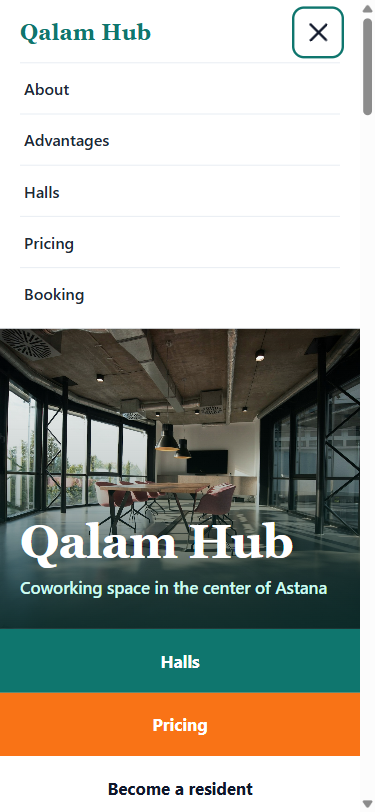
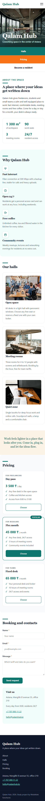
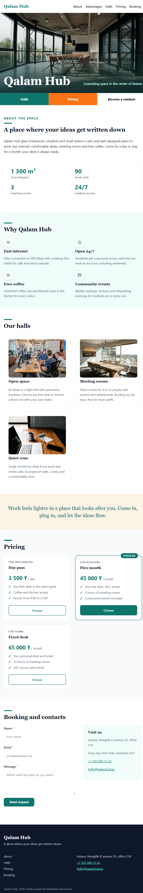
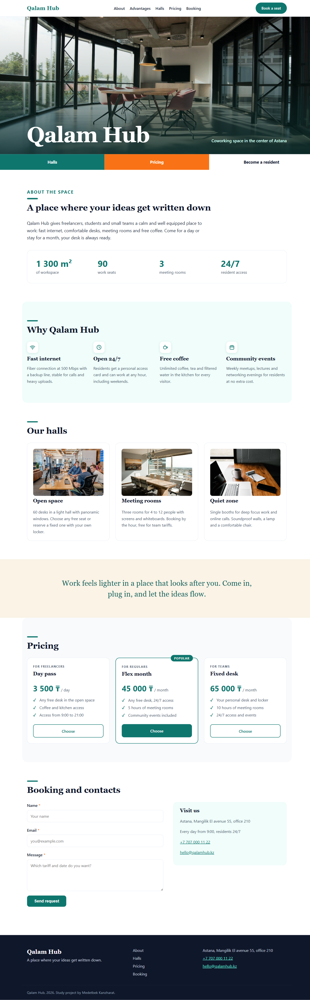

# Qalam Hub, coworking landing page

Study project for the HTML5 course: Lab 2 (markup and plain CSS) and Lab 3 (responsive layout, track D: modern plain CSS).

Topic: coworking space with tariffs, halls and seat booking.

Live site: https://kanzharat.github.io/landing-medetbek/

Repository: https://github.com/kanzharat/landing-medetbek

## What is implemented

- Semantic HTML5 markup: header, nav, main, section, article, footer
- Five content blocks: header with menu, about, advantages, halls, pricing, booking with contacts
- Booking form with name, email and message fields, each field has its own label and required
- Heading hierarchy from h1 to h3, every image has an alt text
- In head: title, meta description, meta viewport, SVG favicon
- Responsive layout for phone, tablet and desktop, checked at 375, 768 and 1280 px, no horizontal scroll
- Burger menu on the phone without JavaScript
- No frameworks, preprocessors, templates or builders, all code written by hand
- Photos from Unsplash under the free Unsplash license, icons and favicon are hand drawn SVG

## Responsive

| Range | Width | Menu | Cards per row |
|---|---|---|---|
| Phone | up to 599 px | burger button, menu opens under the header | 1 |
| Tablet | 600 to 1023 px | links in a row, sticky header | 2 |
| Desktop | from 1024 px | links in a row plus the "Book a seat" button | 3 |

The card grids switch on the width of their section, not the window. A section is 40 px narrower than the window because of its padding, and a desktop browser can take another 15 to 17 px for the scrollbar, so the container thresholds are 540 px and 960 px.

The menu is CSS only: it closes with the cross button, and the header is not sticky on the phone, so an open menu scrolls away after a link is tapped.

Checked in Chromium at 320, 375, 599, 600, 768, 1023, 1024 and 1280 px: `document.documentElement.scrollWidth <= window.innerWidth` is true everywhere and no element sticks out of the viewport.

### 375 px, phone

| Menu open | Full page |
|---|---|
|  |  |

### 768 px, tablet

### 1280 px, desktop

## Modern CSS features used

All styles are in one file, css/style.css, there is no build step.

- CSS variables in `:root`: colours, `--container`, `--gutter`, `--radius`, `--header-h` and a fluid type scale `--fs-*`. One place to change a value for the whole page.
- `clamp()`: every heading, the stats, the quote, the price and the section padding use `clamp(min, preferred, max)`, so the text scales with the window without a media query. The hero image height is `clamp(300px, 55vw, 560px)`.
- Native nesting: the header, the card and the booking form are written as one nested block each, with `&:hover`, `&:has()` and `@media` or `@container` inside the rule. This is what Sass nesting did, now in the browser.
- Container queries: every `main > section` is a container (`container: page-section / inline-size`). `.cards` goes 1, 2, 3 columns and `.advantage-list` 1, 2, 4 columns by the section width. The same grid is used in two sections and would adapt in a narrower column as well.
- `:has()`: `.site-header:has(#nav-toggle:checked)` opens the menu when the hidden checkbox is checked, so the burger works without JavaScript. `.card:has(.badge)` highlights the featured tariff by its content instead of an extra class, and `label:has(+ :required)::after` puts a star after the label of a required field.
- `@supports not selector(:has(a))` shows the menu as a plain list in browsers without `:has()`.

## Why this tool

I chose modern plain CSS because everything runs directly in the browser: no compiler, no node_modules, and the file in the repository is exactly what GitHub Pages serves and what DevTools shows. Variables, nesting and `clamp()` cover everything I would have used Sass for on this page, so the styles stay in one readable file. Container queries let the card grid react to the width of its section instead of the window, which makes the grid a reusable component. `:has()` replaced the JavaScript that a burger menu normally needs. Where it gets in the way: there are no mixins, loops or functions, so the three coloured stripes are written by hand, the file grows to 800 lines without partials, and a typo silently drops a rule because nothing compiles it. Compared with Tailwind and Bootstrap the markup stays semantic and there is no 100 to 300 KB of someone else's CSS, but there are no ready components either. Compared with Sass I get the same variables and nesting without a build step, at the price of newer browser requirements: `:has()` in Firefox only since version 121, nesting without `&` since Chrome 120.

## AI tools

Gemini was used to understand the assignment text and to write the comments in the code. All CSS was written and checked by hand and can be explained line by line.

## Structure

- index.html, page markup
- css/style.css, all styles
- img/, favicon and photos
- screenshots/, the page at 375, 768 and 1280 px for the Responsive section
